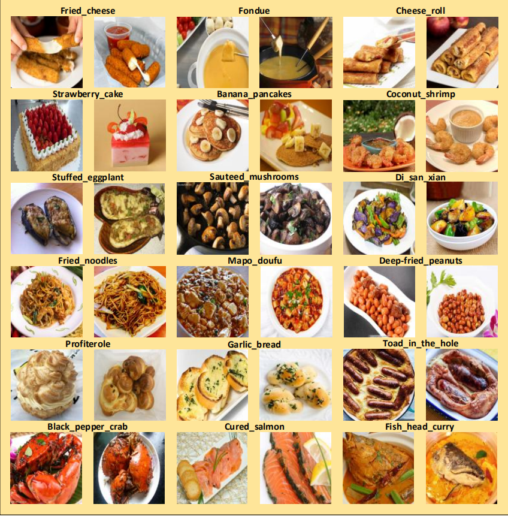

# <p align="center"> ISIA Food-500: A dataset for Large-Scale Food Recognition via Stacked Global-Local Attention Network</p>

# Data collection
ISIA Food-500 consists of `399,726` food items.Each item includes the food name,food images.There are totally `500` kinds of food dishes.



## The dataset can also be downloaded from the following links:
[[image.rar]](https://www.google.com/?hl=zh_tw)
[[metadata.rar]](https://www.google.com/?hl=zh_tw)
[[readme.txt]](https://www.google.com/?hl=zh_tw)

## The dataset can also be downloaded from the following link:
http://123.57.42.89/FoodComputing__Dataset_files/FoodComputing__ISIA500.html

## Code Implementation
This is a PyTorch implementation of the ACMMM2020 paper "ISIA Food-500: A dataset for Large-Scale Food Recognition via Stacked Global-Local Attention Network" (Weiqing Min, Linhu Liu, Zhiling Wang,Zhengdong Luo, Xiaoming Wei, Xiaolin Wei and Shuqiang Jiang).

## Requirements
- python 2.7
- pytorch 0.4+

## Datasets


## Train the model

## Reference
If you are interested in our work and want to cite it, please acknowledge the following paper:


```
@InProceedings{
} 
```
